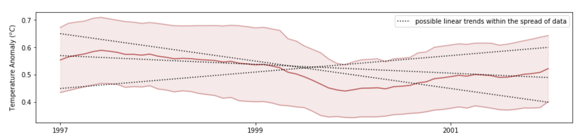

---
jupytext:
  formats: ipynb,md:myst
  text_representation:
    extension: .md
    format_name: myst
    format_version: 0.13
    jupytext_version: 1.11.5
kernelspec:
  display_name: Python 3 (ipykernel)
  language: python
  name: python3
---

```{code-cell} ipython3
import numpy as np
import matplotlib.pyplot as plt
from datetime import datetime
```

# Assignment 1 -- CO2/temperature

+++

## Objective 1 - Obtain, Scrub, and Plot Temperature and CO2 Records From 1958 to 2016

This assignment is about analyzing two data sets that comprise a major part of the global warming discussion: **(1)** global land-ocean
temperature anomalies from 1880 to 2016 that show evidence for an increase in global temperatures, and **(2)** a
classic record from Mauna Loa, Hawaii, that tracks the global trend in atmospheric CO2 from 1958 to 2021. The location where these measurements were taken is important; since Mauna Loa is very isolated in the middle of the Pacific Ocean and far away from any local pollutant (CO2) sources, it is reasonable to take these measurements as representative of the global average concentration.
We will address the question of the time intervals needed to clearly pick out trends in these two records that cannot
be accounted for by seasonal (or other) variations. This kind of issue is at the heart of many discussions in science.
For anyone wanting to to a deep dive (optional), the CO2 records are discussed at http://scrippsco2.ucsd.edu/data/atmospheric_co2/. A good discussion of global temperature trends (and their cause) on annual and decadal timescales is: http://data.giss.nasa.gov/gistemp/ and a summary of the temperature data and analyses can be found in the "Background and History" links on that page.

### Learning Objectives

* Work with data as you would find it "in the wild" -- no help from e211 functions this time

* Recycle code from previous assignments, modifying it to suit a new purpose

* Use functions effectively to avoid repeating code

* Use your own code to process real data, then - based on that statistical work - draw some important scientific conclusions and identify some limitations of those conclusions


### 1) Get the Raw Temperature and CO2 Data and Plot it from 1958 to 2016

In the same folder as this assignment, there is a file called `temperature_1880_2016.dat`. This file contains monthly averaged temperature data from 1880 to 2016. This time, there is no handy `e211.getthedata()` function for reading the datesets into Python, you will have to write them yourself.  Write 2 functions: `get_co2()`, `get_temps()`, that take in the names of the datasets to load and return numpy arrays. The outputs of each function should look something like the following:

A) For `get_temps()`: Monthly temperature anomaly between April 1958 and September 2016, e.g.

```
temp = array([1.1750e-01,  1.0690e-01,  ...,  8.8980e-01,  8.6150e-01, 8.9660e-01,  8.8690e-01])
```

B) For `get_co2()`: Monthly Mauna Loa CO2 values from 1880 to 2021.  Get the data with gaps filled but *not* seasonally adjusted (see first hint below).

```
CO2 = array([317.45, 317.5 , 317.24,  ..., 404.5 , 402.24, 401.01])
```

For both functions: An array containing the dates of each measurement, to be used for labelling plots

```
date = array([datetime.datetime(1880, 4, 15, 0, 0), datetime.datetime(1880, 2, 15, 0, 0), ...,
              datetime.datetime(2016, 7, 15, 0, 0), datetime.datetime(2016, 8, 15, 0, 0)], dtype=object)
       
```

In addition, write another function called `combine_datasets()` that takes in a start date, end date, and the datasets, and outputs arrays which only span the specified time interval (so you only need one `date` array). Include statements to check for valid inputs as you see fit.

Note that all of your functions written for this assignment should work when called with code like that given in our example `main` function toward the end of this write-up, so make sure to organize your function inputs and outputs accordingly.

#### Helpful Hints

* It may be useful to open each raw dataset in an editor (plain text, excel, etc.) to examine the included *metadata*, which explains what each column represents (especially for (B)). Take a look at e.g. the CO2 file to make sure you are reading in the column requested above and also to notice what value has clearly been assigned to missing data. 

* To parse new file types with Python, start by typing "*convert .dat file to numpy array*" into your favorite search engine. There are many, many helpful functions and tutorials available for pretty much any data type. 

* This assignment is meant to incorporate many of the skills from previous labs/worksheets. Recycling previous code is highly encouraged! (Be sure to credit source if you are recycling code that isn't yours - use comments throughout your code)

* Oftentimes, data scrubbing is the most laborious part of a scientific study. Taking the extra time and doing a good job here will make Part 2 much easier. For example, the CO2 record has some missing values at the beginning and end that you probably want to ditch so as to avoid having to always check for these and not plot them. 

* It's always a good idea to check that any data ingestion has gone as expected by making a plot and/or printing a few values to the screen.  For example, if you plot your CO2 data (excluding data flagged as 'missing') after calling your `get_co2()` function but before calling the `combine_datasets()`, you should get a plot that looks like the one you can find here https://scrippsco2.ucsd.edu/graphics_gallery/mauna_loa_record/mauna_loa_record.html
---

### To Hand In For Part 1

- Code: your 3 functions: `get_temps()`, `get_co2()`, and `combine_datasets()`.  See instructions in the what to turn in for Part 2 section for how to organize these.

- A scientific figure of the raw data over the period **April 1958 - September 2016**. Your figure should contain two subplots, the upper one showing temperature records and the bottom one CO2, both as functions of time with monthly resolution.

```{code-cell} ipython3
# your get_temps(filename) here
```

```{code-cell} ipython3
# your get_co2(filename) here
```

``` python
# test it
fname_temp = './temperature_1880_2016.dat'
fname_co2 = './monthly_in_situ_co2_mlo.csv'
tdata, ttime = get_temps(fname_temp)
co2data, co2time = get_co2(fname_co2)

isel = co2data > 0
plt.plot(co2time[isel],co2data[isel])
plt.xlabel('year')
plt.ylabel('CO2 concentration (ppm)');
```

```{code-cell} ipython3
# your combine_datasets(temp_in, date_temp, co2_in, date_co2, date_min, date_max) here

#In addition, write another function called combine_datasets() that takes in a 
#start date, end date, and the datasets, and outputs arrays which only span the 
#specified time interval (so you only need one date array). 
#Include statements to check for valid inputs as you see fit.
```

``` python
# define our user inputs here
date_min = datetime(1960,1,15)
date_max = datetime(2016,1,15)

# call all the functions to do the analysis (this will turn into "main()" later)
temp_raw, date_tdata = get_temps("temperature_1880_2016.dat")
co2_raw, date_co2 = get_co2("monthly_in_situ_co2_mlo.csv")
temp, CO2, date = combine_datasets(temp_raw, date_tdata, co2_raw, date_co2, date_min, date_max)
```

```{code-cell} ipython3
# your Part 1 figure here
```

## Objective 2 - Statistics and Analysis

Suppose I make the following claim:

>*Although on the whole, CO2 and temperature appear to be increasing, there are many years, or even several decades where global temperature drops in which CO2 increases -- therefore temperature and CO2 must not be as tightly linked as climate alarmists say they are (look at 1990-1994, or 2010-2014). Furthermore, the overall temperature anomaly is very small (the whole range is 1.4$^o$C) and the data is highly variable. Therefore, these claims made by the climate alarmists are probably over-exaggerated.*

To support or refute this claim, let's first go back to our data and run some analysis to back up our answer. Implement your running mean function from the week 8 lab to filter the data (good thing we made it work for *any* dataset!). In addition, we would like some way to quantify the variability within the averaged data over a particular time period, to provide a *confidence interval* when looking for trends. A good way to do this is to take the *standard deviation* within the window, given by:

$$
\sigma = \sqrt{\frac{{\sum_{i}^{N} (x_i - \bar{x})^2}}{N}}
$$

where $x_i$ is the value at each point $i$, $\bar{x}$ the mean within the window and $N$ is the length of the window.

Define an additional function similar to your running mean called `running_std()`, that computes the standard deviation of the data within each window. In your function you can implement the equation above or use the built-in `np.std()`. 

Once you have the mean and standard deviation functions working (test them!), write one more function `do_plot()` that allows you to plot your results by writing a single line of code, such as in the example below. Your plot should include two subplots, one each for temperature and CO2 and should show the raw data, the running mean and the running mean +/- 1 standard deviation. (*HINT: modify your plot from part 1 and wrap it in a function. The plot function should output a figure to the screen and return `None`*). 

We will use a `main()` function (defined for you below) to run the whole analysis over different time periods and window lengths, and come up with a well-supported answer to the claim above.

```{code-cell} ipython3
# your running_mean(data, winlen) here
```

```{code-cell} ipython3
# your running_std(data, winlen)  here
```

```{code-cell} ipython3
# your do_plot(temp,temp_mean, temp_std, CO2, CO2_mean, CO2_std, dates)  here
```

``` python
def main(date_min, date_max, window_len):
    """
    main function that performs the analysis for EOSC 211, assignment 1

        IN: date_min, date_max (datetime obj) -- the beginning and end of the analysis period
            window_len -- the length of the window (int, months) with which to filter data
                          and calculate the running standard deviation

        OUT: a plot showing global temperature anomaly (oC) and CO2 concentration (ppm) at
             Mauna Loa Observatory, Hawaii, USA
    """
    # get the raw data
    temp_raw, date_tdata = get_temps("temperature_1880_2016.dat")
    CO2_raw, date_co2 = get_co2("monthly_in_situ_co2_mlo.csv")

    # combine and truncate the data sets
    temp, CO2, date = combine_datasets(
        temp_raw, date_tdata, CO2_raw, date_co2, date_min, date_max
    )
    
    # filter the data and get the standard deviations
    temp_mn = running_mean(temp, window_len)
    temp_sd = running_std(temp, window_len)
    CO2_mn = running_mean(CO2, window_len)
    CO2_sd = running_std(CO2, window_len)

    # make a pretty plot
    do_plot(temp,temp_mn, temp_sd, CO2, CO2_mn, CO2_sd, date)
    
    return None
```

+++

### Analysis Questions



**1)** Now that we can quickly produce and present the filtered data, its time to answer the question at hand. Pick a 10 year period over which the temperature is decreasing and plot it with filter lengths 1 month (i.e. no filter), 11 months, 61 months, and 121 months. If you've written the functions correctly, you should be able to create each plot with a *single line of code!* 

As you increase the filter length, what happens to the apparent trend in the data? What happens to the spread?

```{code-cell} ipython3
# your code here
```

**2)** Now plot the whole dataset (1968-2016) with a 120 month filter. Within the data spread, how sure are you about the trend?

```{code-cell} ipython3
# your code here
```

### To Hand in Part 2

- Copy your 6 functions `get_temps()`, `get_co2()`, `combine_datasets()`, `running_mean()`, `running_std()` and `do_plot()` into a separate notebook, one function per cell. Do not add anything of you testing scripts to that notebook, and make sure your functions are 'clean': i.e., they don't produce unecessary output (e.g. via print statements that you might have included during testing).  Don't include any markdown cells, only code cells. Call Download this notebook as .py, called it `a1_functions.py` and upload it to Canvas.

- 5 figures as described above, varying the window size

- Maximum 2 paragraphs / 0.5 page of text (12 pt font maximum) analyzing your results. What are the timescales of variations in global temperature measurements? How would you **quantitatively** answer the claim that temperature is varying independently of CO2?  Check that you think your answer would still be valid if you were to choose a different 10-year interval.   Make sure that anything you write here is a result based on your data.

+++

``` python
# 8 plots with 6 lines of code. How neat is that??
date_min = datetime(1994, 1, 15)
date_max = datetime(2004, 1, 15)
main(date_min, date_max, 1)
main(date_min, date_max, 11)
main(date_min, date_max, 61)
main(date_min, date_max, 121)
```

+++

**Analysis - Andrew**

The raw global average temperature series is a very noisy dataset. We can see *seasonal variability*, *interannual variability* from things like the ENSO or Pacific Decadal oscillations, as well as isolated events that influence global climate -- like the eruotion of Mt. Pinatubo in 1991 which deposited massive amounts of *aerosols* into the atmosphere, altering the planetary radiation balance which resulted in a ~5 year cooling trend. 

However, when we average away the short term trends, all points to temperatures increasing in step with CO2 on multi-decadal  timescales (10's of years), even when we consider the variability in the data. Climate change happens slowly by human standards, often leading to claims like the one we investigated. If we consider the trend in terms of geological time, temperature changes this rapid are unprecedented and are surely cause for concern!
